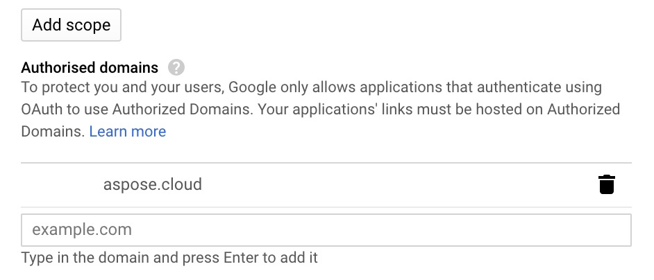

{} 

The page contains Google Drive Storage configuration.

{} 

You have to complete following steps to configure the Storage:

- Create Google account if you don't have one.
- Go to [Google API console](https://console.developers.google.com/).
- Create a New Project.
- In **APIs and Services** menu, click on **ENABLE APIS AND SERVICES** button and enable **Google Drive API**.
- Go to **Credentials** options and add information in **OAuth consent screen**.

- Now select **OAuth client ID** option under **Create Credentials** menu.

- Select **Web Application** as Application Type.
- Enter <https://dashboard.aspose.cloud/breeze/UserData/GetGoogleDriveCallback> in Authorised redirect URIs field.
- You may first need to add **aspose.cloud** in Authorised domains field as shown below:

- Once you have created **OAuth client ID**, take a note of Client ID and Client secret, we will use it shortly.
- Open <https://dashboard.aspose.cloud/>, select **My Storage** tab**.**
- Select **Google Drive Storage** from **Create New Storage** menu.
- Enter Storage Name, Client ID and Client secret.
- Push **Generate Refresh Token** button and allow access.
- Allow access
- Save Storage

Now you can use it by its name in the service API with this account.
