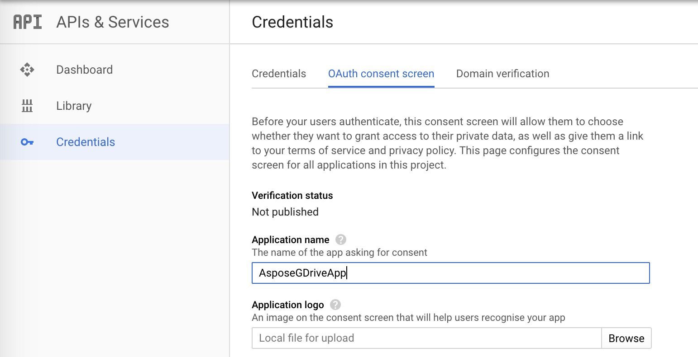
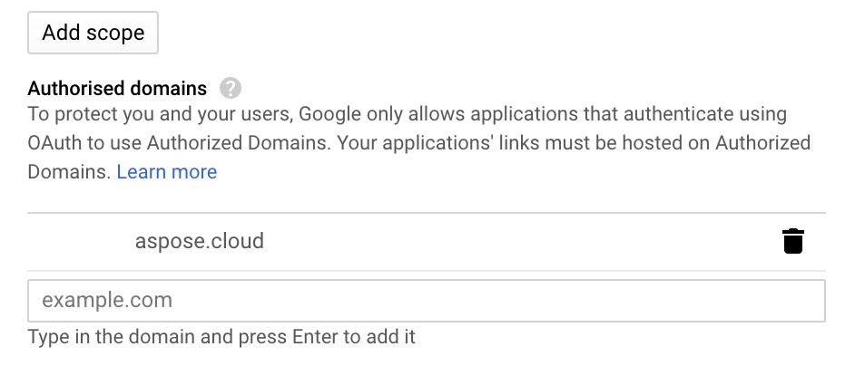

You have to complete following steps to connect Google Drive with our APIs:

## Setup new Google Drive project ##

- Create Google account if you don't have one.
- Go to [Google API console](https://console.developers.google.com/).
- Create a New Project.
- In **APIs and Services** menu, click on **ENABLE APIS AND SERVICES** button and enable **Google Drive API**.
- Go to **Credentials** options and add information in **OAuth consent screen**.

- Now select **OAuth client ID** option under **Create Credentials** menu.

- Select **Web Application** as Application Type.
- Enter <https://dashboard.aspose.cloud/storages/googledrive/callback> in Authorised redirect URIs field.
- You may first need to add **aspose.cloud** in Authorised domains field as shown below:

- Once you have created **OAuth client ID**, take a note of Client ID and Client Secret, we will use it shortly.

## Connect the Google Drive storage account ##

* Log into [Dashboard](https://dashboard.groupdocs.cloud).
* Access the [Storages](https://dashboard.groupdocs.cloud/storages) Page.
* Select [Google Drive Storage](https://dashboard.groupdocs.cloud/storages/dropbox/create) from the 'Create New Storage' menu.
* Enter Storage Name of your choice.
* Enter Client ID and Client Secret previously saved.
* Push **Generate Refresh Token** button and allow access of our API to your Google Drive files.
* Save Storage

Now you can use it by its name in the service API with this account.
